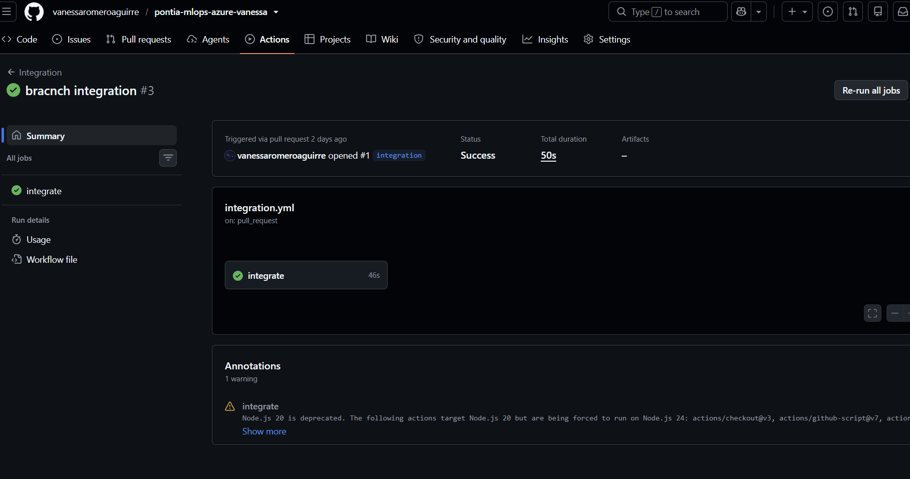
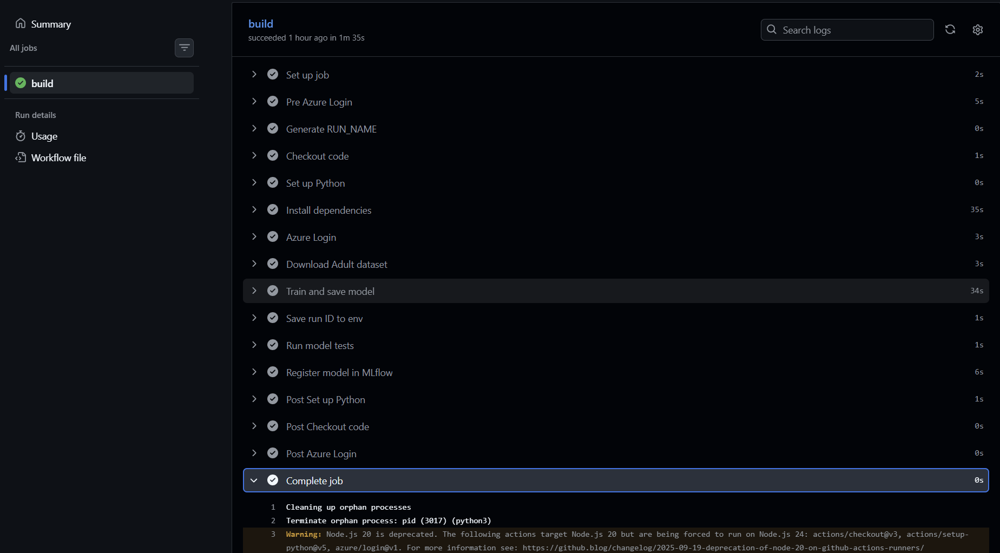
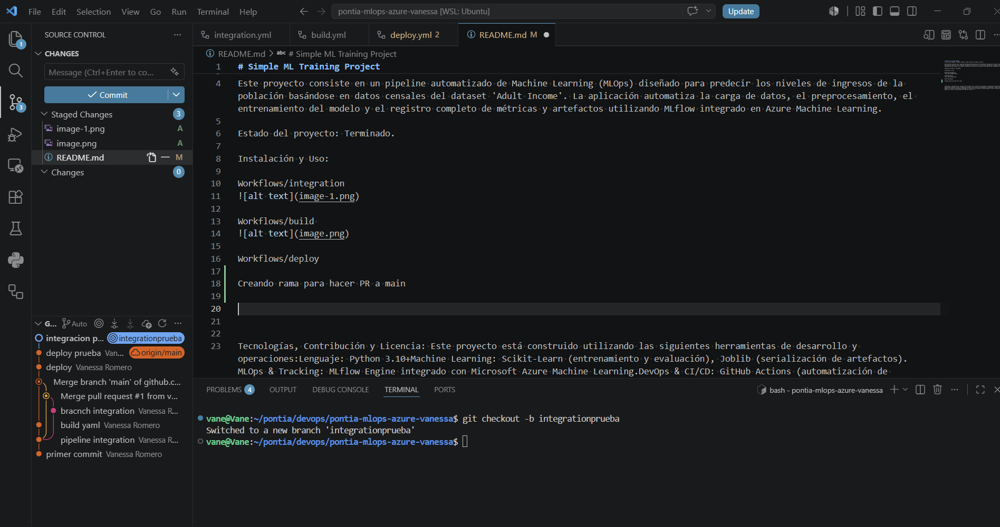

# Simple ML Training Project
Título y descripción: Predecir Ingresos (Adult Income) con MLOps y MLflow

Este proyecto consiste en un pipeline automatizado de Machine Learning (MLOps) diseñado para predecir los niveles de ingresos de la población basándose en datos censales del dataset 'Adult Income'. La aplicación automatiza la carga de datos, el preprocesamiento, el entrenamiento del modelo y el registro completo de métricas y artefactos utilizando MLflow integrado en Azure Machine Learning.

Estado del proyecto: Terminado.

Instalación y Uso:

Workflows/integration

Workflows/build 

Workflows/deploy

Creando rama para hacer PR a main

Tecnologías, Contribución y Licencia: Este proyecto está construido utilizando las siguientes herramientas de desarrollo y operaciones:Lenguaje: Python 3.10+Machine Learning: Scikit-Learn (entrenamiento y evaluación), Joblib (serialización de artefactos).MLOps & Tracking: MLflow Engine integrado con Microsoft Azure Machine Learning.DevOps & CI/CD: GitHub Actions (automatización de pipelines), Docker & GitHub Container Registry (ghcr.io).
